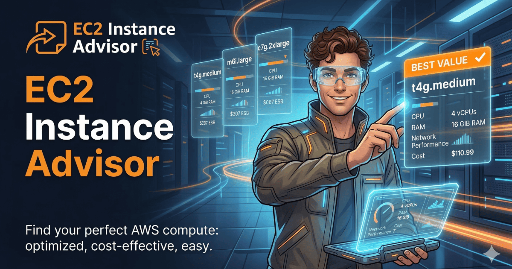

<p align="center">
  
</p>

<h1 align="center">EC2 Instance Advisor</h1>

<p align="center">
  <strong>Find the right AWS EC2 instance in minutes, not hours.</strong><br/>
  Compare 100+ instance types across 30 regions — scored by price, CPU, memory, GPU, and network.
</p>

<p align="center">
  <a href="https://varadmore.me/ec2-instance-advisor/"><strong>Live App</strong></a>&ensp;·&ensp;
  <a href="https://github.com/varad-more/ec2-instance-advisor/issues">Report Bug</a>&ensp;·&ensp;
  <a href="#contributing">Contribute</a>
</p>

<p align="center">
  
  
  
  
</p>

<br />

<p align="center">
  <a href="https://varadmore.me/ec2-instance-advisor/">
    
  </a>
</p>

---

## The Problem

AWS offers 800+ EC2 instance types. Choosing the right one means juggling console tabs, pricing pages, and spreadsheets. Most teams default to `m5.xlarge` because comparing alternatives takes too long.

## The Solution

EC2 Instance Advisor answers one question:

> **Given my workload priorities and budget, which EC2 instance should I use?**

It combines regional pricing data, instance specs, and a weighted scoring model into a guided workflow — all running as a static site with **zero backend**.

## Features

- **Guided funnel** — Learn families, compare specs, get recommendations, estimate costs
- **Weighted scoring** — Tune Price / CPU / Memory / Network / GPU priorities with presets or custom weights
- **Interactive charts** — Parallel coordinates, radar, bar, scatter, and line charts (Plotly.js)
- **Transparent recommendations** — Every result includes a score breakdown and natural-language explanation
- **TCO calculator** — Estimate monthly costs across On-Demand, Reserved, and Savings Plan billing
- **30 AWS regions** — Compare prices globally with instant region switching
- **Shareable URLs** — Filters and weights are encoded in the URL hash
- **Keyboard shortcuts** — Power-user friendly with hotkeys for presets and navigation
- **Fully responsive** — Works on desktop, tablet, and mobile
- **No backend, no login, no tracking** — Everything runs client-side

---

## Quick Start

### Run Locally

```bash
git clone https://github.com/varad-more/ec2-instance-advisor.git
cd ec2-instance-advisor
python3 -m http.server 8080 --directory docs
# Open http://localhost:8080
```

> A local HTTP server is needed because the app uses `fetch()` to load CSV data (`file://` protocol won't work).

### Refresh Pricing Data

```bash
python3 scripts/fetch_aws_prices_once.py
```

Pulls current on-demand Linux prices from the [AWS public pricing API](https://pricing.us-east-1.amazonaws.com/offers/v1.0/aws/AmazonEC2/current/index.json) and writes to `data/` and `docs/data/`.

---

## How It Works

### Usage

1. **Pick a region** — Use the globe dropdown in the navbar (or `←`/`→` keys)
2. **Explore families** — Cards explain what each category is optimized for
3. **Set priorities** — Use segment bars (Off / Low / Med / High / Max) or presets (`B` `C` `P` `M`)
4. **Review results** — See the #1 match with score breakdown, runners-up, and explanation
5. **Estimate costs** — TCO calculator factors in compute, EBS, and egress across billing models

### Scoring Methodology

The advisor uses **Multi-Criteria Decision Analysis (MCDA)** with rank-based normalization:

1. **Filter** instances by region and selected categories
2. **Rank-normalize** each metric to \[0, 1\] using fractional ranks:
   - **Price Efficiency** — `$/compute_unit` where `compute_units = vCPUs + 0.25 * RAM + 4 * GPUs` (lower is better)
   - **CPU** — vCPU count
   - **Memory** — GiB
   - **Network** — ordinal score (1–5)
   - **GPU** — GPU count
3. **Weighted sum** — `score = sum(weight_i * score_i)`, weights normalized to sum to 1.0
4. **Sort** descending — #1 is the recommendation

#### Why Rank Normalization?

Min-max normalization collapses when a single \$32/hr GPU instance sets the price ceiling — every sub-\$1 instance scores ~1.0 and becomes indistinguishable. Rank normalization distributes scores uniformly regardless of outliers.

### Limitations

- Prices are a **point-in-time snapshot** — they drift from live AWS pricing over time
- Only **Linux on-demand, shared tenancy** SKUs are scored
- Network is a coarse ordinal (1–5), not actual throughput
- EBS/egress rates in the TCO calculator use **us-east-1 reference rates**
- This is a **shortlisting tool** — always benchmark your workload before committing

---

## Project Structure

```
ec2-instance-advisor/
├── docs/                          # Static site (deploy root)
│   ├── index.html                 # App: HTML + inline JS (~4,800 lines)
│   ├── styles.css                 # Styling + responsive breakpoints (~6,600 lines)
│   ├── data/
│   │   └── ec2_aws_snapshot.csv   # Pricing snapshot (2,570 rows x 10 columns)
│   ├── favicon.svg / .ico / .png  # Favicons
│   ├── ogcard.png                 # Open Graph social card
│   ├── robots.txt
│   ├── sitemap.xml
│   ├── site.webmanifest
│   └── .nojekyll
├── data/
│   └── ec2_aws_snapshot.csv       # Local copy (identical to docs/data/)
├── scripts/
│   └── fetch_aws_prices_once.py   # AWS pricing API fetcher (Python 3, stdlib only)
├── LICENSE
└── README.md
```

### Architecture

The app is a **zero-dependency static SPA** (Plotly.js loaded via CDN):

- **No build step** — serve `docs/` with any HTTP server
- **No framework** — vanilla HTML, CSS, JS
- **No backend** — all scoring runs client-side
- **Centralized state** — a single `state` object drives the entire UI

### CSV Schema

| Column | Type | Description |
|--------|------|-------------|
| `instance_type` | string | e.g. `m7g.xlarge` |
| `family` | string | e.g. `Compute optimized` |
| `instance_category` | string | `CPU`, `GPU`, `Memory`, `Storage`, or `General` |
| `region` | string | AWS region code, e.g. `us-east-1` |
| `vcpus` | int | vCPU count |
| `memory_gib` | float | RAM in GiB |
| `network_score` | int | 1–5 ordinal from network performance strings |
| `gpu_count` | int | Number of GPUs (0 for non-GPU) |
| `price_usd_hour` | float | On-demand hourly price (USD) |
| `workload_tag` | string | High-level category tag |

---

## Deployment

### GitHub Pages

In repo **Settings > Pages**:
- **Source**: Deploy from a branch
- **Branch**: `main`, folder `/docs`

Live at `https://<username>.github.io/ec2-instance-advisor/`

### Any Static Host

Copy the `docs/` folder to your web root. No server-side processing needed.

---

## Keyboard Shortcuts

| Key | Action |
|-----|--------|
| `←` / `→` | Cycle AWS regions |
| `B` | Balanced preset |
| `C` | Cost-optimized preset |
| `P` | Performance preset |
| `M` | ML / GPU preset |
| `/` | Focus instance search |

---

## Workload Guide

| Workload | Family | Why |
|----------|--------|-----|
| Web servers, microservices | General Purpose (M/T) | Balanced CPU + memory; T-series for burstable dev/test |
| High-traffic APIs, HPC | Compute Optimized (C) | High vCPU-to-memory ratio for sustained throughput |
| In-memory DBs, caches | Memory Optimized (R/X) | 8:1+ RAM-to-vCPU for Redis, SAP HANA, analytics |
| NoSQL, data warehousing | Storage Optimized (I/D) | Local NVMe SSDs for low-latency IOPS |
| ML training, inference | Accelerated (P/G/Trn/Inf) | GPU/accelerator workloads; Trn/Inf for AWS ML silicon |

---

## Contributing

Contributions are welcome. If you open a PR, briefly describe:

- What UX or data problem it solves
- Whether it changes scoring behavior
- Any new pricing or region assumptions

### Ideas

- Guided wizard (questions -> auto-set weights)
- RI / Savings Plan pricing in scoring
- Column visibility toggle in Browse table
- Dark mode
- Spot pricing integration

---

## Analytics (Optional)

The app supports optional GA4 tracking. To enable:

```js
// Global variable (before the app script)
window.EC2_ADVISOR_GA4_ID = "G-XXXXXXXXXX";

// Or via localStorage
localStorage.setItem('ec2AdvisorGaId', 'G-XXXXXXXXXX');
```

Analytics stays fully disabled if no ID is configured.

---

## License

This project is licensed under the [MIT License](LICENSE).

---

## Disclaimer

This project is **not affiliated with, endorsed by, or sponsored by Amazon Web Services**. EC2 and AWS are trademarks of Amazon.com, Inc. Pricing data comes from publicly available AWS APIs. Always verify pricing and specs on the [official AWS console](https://aws.amazon.com/ec2/pricing/) before making purchasing decisions.

---

<p align="center">
  Built by <a href="https://varadmore.me">Varad More</a>
</p>
